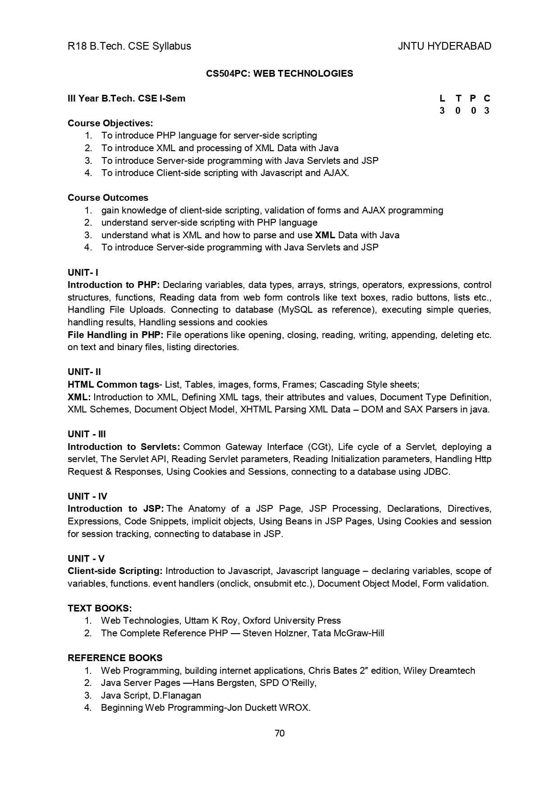

# WT-CSE_A
#### _Unit 01 Complete notes uploaded under PHP folder_

15 Sept 2021 | Tables, Frames

16 Sept 2021 | Forms [Registration & Login Form], CSS | Introduction, Inline CSS

18 Sept 2021 | CSS | External CSS

20 Sept 2021 | CSS | Box Model, Border Property, Margin Property

22 Sept 2021 | CSS | Frame 02, Login Page

23 Sept 2021 | PHP | Introduction, Declaring Variable, Control Statement, Loops

24 Sept 2021 | PHP | Loops, Arrays

29 Sept 2021 | PHP | Associative Arary, Multidimensional Array, Array built-in function

30 Sept 2021 | PHP | Functions, Reading Data from web form controls [textbox, textarea, radio button]

01 Oct 2021 | PHP  | Reading Data from web form controls [checkbox, password, dropdown list]

04 Oct 2021 | PHP | Revision |  Reading data from web form controls

21 Oct 2021 | PHP | Cookies and Session in PHP, File Handling in PHP- Opening, Closing, Reading, Writing Text and Binary File

23 Oct 2021 | XML | Introduction to XML, Defining XML Tags, attributes and its values, DTD- Document Type Definition - Internal & External DTD

--------------------------------------------------------------------------------------------------------------------------------

